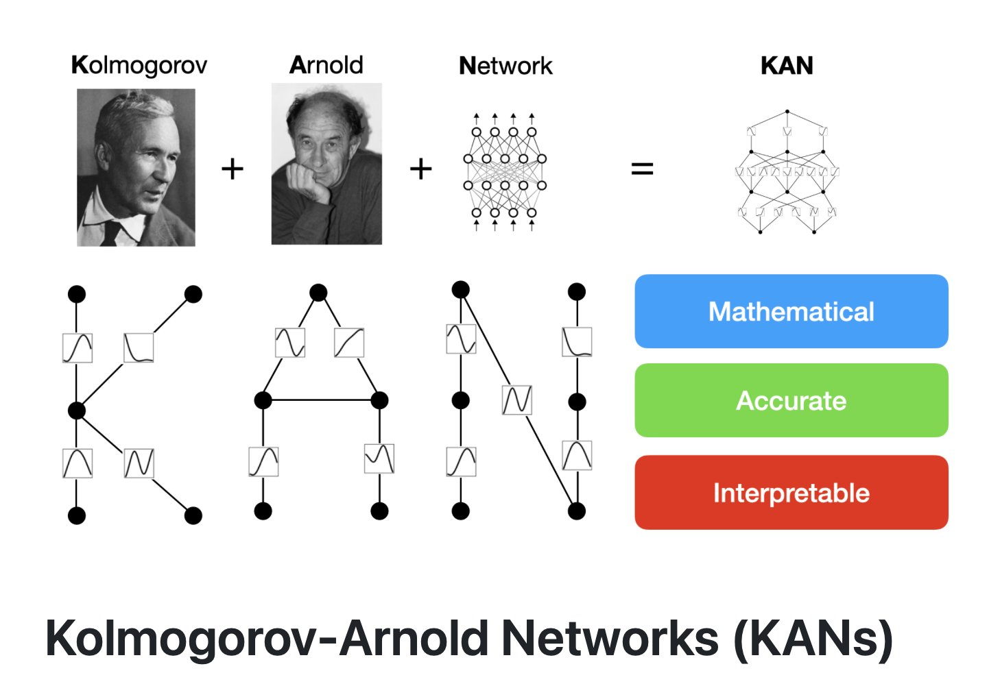

# YOLO-KAN

## Overview

This Repo contains KAN (Kolmogorov Arnold Networks) exploration and Integration with YOLO family model.

KAN Network

## TODO:
- [ ] YoloV8 with KAN
- [ ] YoloV11 with KAN

## References
- [Original KAN](https://arxiv.org/abs/2404.19756): Original KAN Paper
- [Official Implementation](https://github.com/KindXiaoming/pykan): Offical implementation for Kolmogorov Arnold Networks  

- [Efficient KAN](https://github.com/Blealtan/efficient-kan): An efficient pure-PyTorch implementation of Kolmogorov-Arnold Network (KAN)
- [Vision-KAN](https://github.com/chenziwenhaoshuai/Vision-KAN): KAN for Vision Transformer
-  [Awesome KAN](https://github.com/mintisan/awesome-kan): A curated list of awesome libraries, projects, tutorials, papers, and other resources related to Kolmogorov-Arnold Network (KAN).

